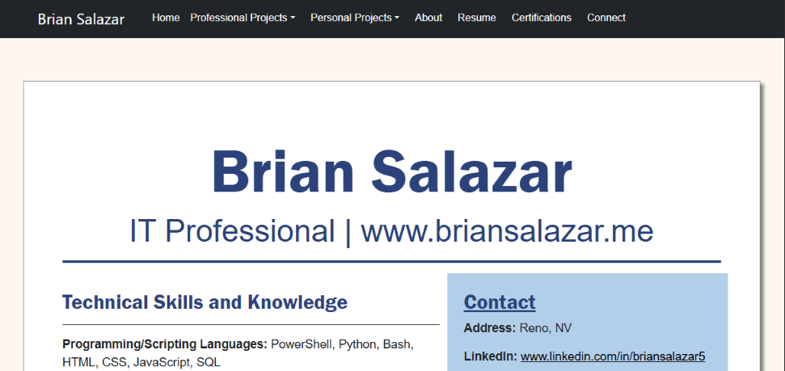
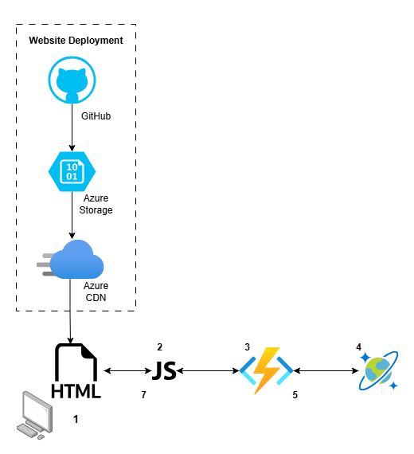

# Cloud Resume Challenge (Azure) & Portfolio Website

**Table of Contents:**
1.	[Project Overview](#project-overview)
2.	[Prerequisites](#prerequisites)
3.	[Technologies Used](#technologies-used)
4.	[Technological Architecture](#technological-architecture)
5.	[Website Components & Integrations](#website-components--integrations)
6.	[Additional Reflection](#additional-reflection)
## Project Overview
The **Cloud Resume Challenge** was completed as an opportunity to gain hands-on experience with Azure technologies. In addition, I had been wanting to move off my WordPress portfolio website for the following reasons:
1.	Save some money.
2.	Practice deploying resources in Azure.
3.	Test my web design abilities.

For more on my experience, I made a blog-style post on my [portfolio website](https://www.briansalazar.net/), hosted in Azure 😉. For anyone interested in pursuing the Cloud Resume Challenge, [here](https://cloudresumechallenge.dev/) is a link to the challenge’s website.
## Prerequisites
To complete the project, the following prerequisites were needed:
-	Azure account
-	GitHub account
-	A domain name
## Technologies Used
For this website, the following technologies were used in deploying it.
-	GitHub
-	GitHub Actions
-	Azure Blob Storage
-	Azure Content Delivery Network
-	Azure Cosmos DB
-	Azure Functions

The upcoming **Website Components section** provides an overview of the technologies used.
## Technological Architecture
The flowchart depicted here is for the Cloud Resume Challenge itself (someone viewing the resume page). 

1. A user visits the resume page.
2. JavaScript Code calls the Azure Function URL.
3. Azure Function retreives the page view count from the CosmosDB and updates it by 1.
4. The updated pageview count is saved to the CosmosDB table.
5. The updated page view count is retreived by the Azure Function.
6. The JavaScript code displays the page view count on the resume page.
## Website Components & Integrations 
### Front-End Overview
The front-end of this project contains various pages, including an HTML version of my resume. At the bottom of the resume page, there is a **page view counter**. The value displayed here is stored in an Azure Cosmos DB and is pulled via an Azure Function and JavaScript code.

In addition to my resume page, I have *recreated my portfolio website*, and there are various other pages, including an about page, contact page, and various other projects I have completed.

For the project, I ended up using the **Bootstrap Framework** for various components of the front-end along with my own CSS styling to achieve the appearance I wanted.
### Back-End Overview
#### Hosting & Static Website
##### Blob Storage
My spin on the Cloud Resume Challenge is hosted using a **Storage Account** in Microsoft Azure. Utilizing the static website feature of **Blob storage**, the contents of this repo are pushed into Blob storage with **GitHub Actions**, and the contents of the website are displayed.
##### Azure CDN
Using **Azure's Content Delivery Network** and a **custom domain**, the website can be accessed at https://www.briansalazar.net.
#### Azure Function & Database
##### Cosmos DB
To ensure the resume page view count is accurate, the total number of views is saved to a **Cosmos DB**. I ended up using the Cosmos **Table API** since that is the one I found easier to work with.
##### Azure Function
Utilizing an **Azure Function** with an **HTTP trigger**, anytime the function is called, the table that holds the resume view count is updated by 1, and the total number of resume views is returned in the HTML response. 

To accomplish this, inside the **function_app.py** file, I used the **Table SDK** to first get the value from Cosmos DB and increase the value by 1. If the function is executed successfully, a 200 status code is returned along with the new value of resume page views.
### Front-End/Back-End Integration
#### Displaying the Total Number of Page Views
The **resumeviews.js** file is responsible for displaying the total number of page views on the resume.html file. 

When the resume.html page loads, that triggers the resumeviews.js file, which then triggers the URL for the Azure function to return the total number of page views. When that Function URL is visited, the HTTP trigger executes the Azure function and performs the behavior as described in the previous section. Using DOM, the value is then displayed at the bottom of the resume page.
## Additional Reflection
A deeper dive into my experience with this project and the steps I took to complete it can be found under the projects section of the website I [created](https://www.briansalazar.net/pages/personal_projects/CloudResumeChallenge.html).